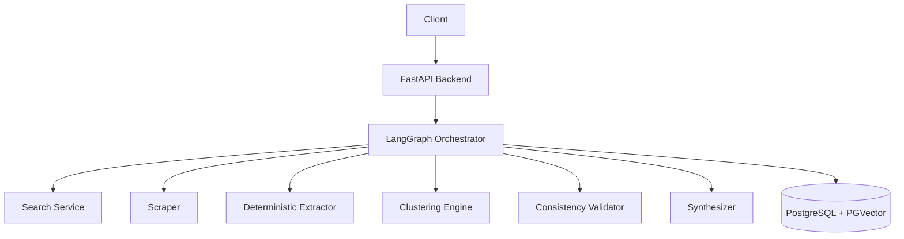
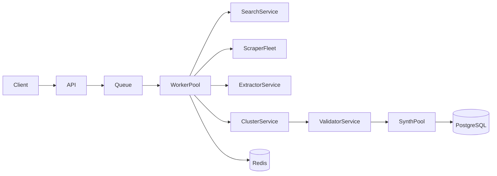

# 🏗️ Architecture Document

## 1. System Overview

The Grounded Multi-Agent Research Engine employs a modular architecture designed around a stateful orchestration graph. It separates the orchestration, data retrieval, deterministic extraction, and LLM synthesis phases.

## 2. Core Components

### 2.1 LangGraph Orchestrator
Acts as the central control plane. It manages the state transitions (Planning -> Researching -> Extracting -> Validating -> Synthesizing) and conditional loops based on confidence scores.

### 2.2 API Layer (FastAPI)
Stateless entry point for clients, exposing endpoints to submit queries, poll system status, and retrieve generated reports.

### 2.3 Search Service & Scraper
* **Search Service:** Queries external providers, fetching top N URLs, deduplicating, and avoiding low-quality domains.
* **Scraper:** Fetches HTML content, strips scripts and boilerplate, and outputs raw, clean text for deterministic processing.

### 2.4 Deterministic Extractor
A zero-LLM component that applies Regex and parsing patterns to deterministically harvest numerical facts, years, and statistics. Maps facts tightly to source URLs to ensure complete traceability.

### 2.5 Validation Layer (Clustering Engine & Consistency Validator)
* **Clustering Engine:** Uses vector embeddings (via PGVector) or TF-IDF to group thematically related facts.
* **Consistency Validator:** Evaluates numbers within a cluster. It identifies contradicting values and establishes a confidence score that informs LangGraph whether to re-search or proceed to synthesis.

### 2.6 Synthesizer
Uses LLMs purely for drafting reports out of pre-validated, extracted facts. Does not accept raw web data and cannot introduce new factual claims.

## 3. Deployment Topology

A scalable, worker-based architecture ensures stability under heavy scraping and extraction loads:

