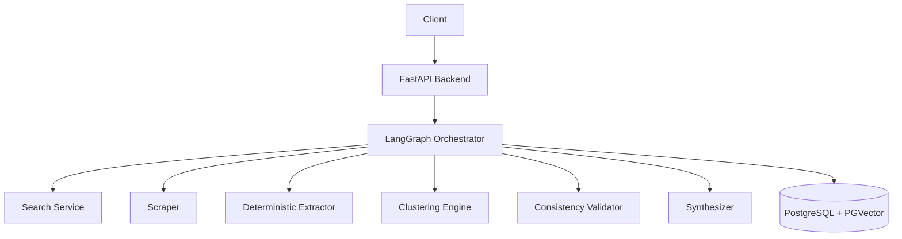
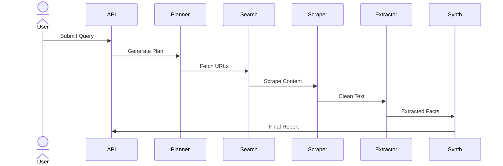
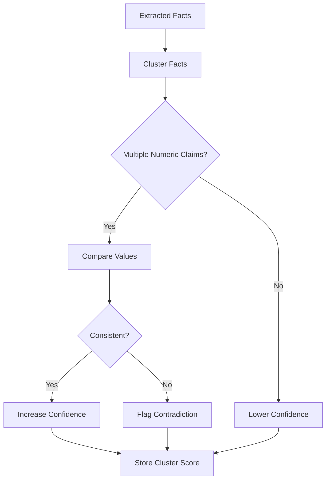
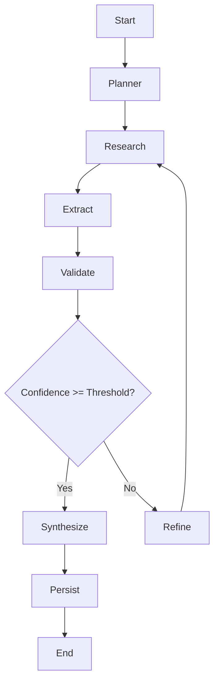
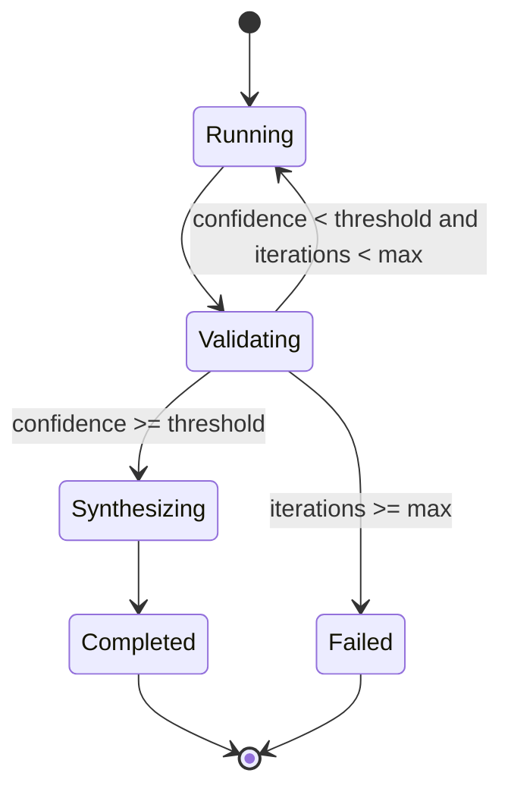
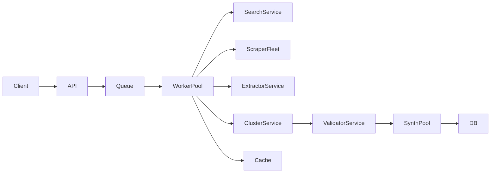

# 📄 Product Requirements Document (PRD)

# Grounded Multi-Agent Research Engine


<br/>

# 1. Executive Summary

The Grounded Multi-Agent Research Engine is a stateful AI research system designed to:

* Collect real-world sources
* Extract measurable claims deterministically
* Validate cross-source consistency
* Compute confidence scores
* Synthesize structured reports using controlled LLM reasoning

The system minimizes hallucination by separating:

1. Retrieval
2. Deterministic extraction
3. Validation
4. Synthesis

Graph-based orchestration is implemented using LangGraph to enable conditional branching and iterative execution.

This project is built as research infrastructure, not an LLM wrapper.

---

# 2. Problem Statement

Most LLM-based research tools:

* Hallucinate citations
* Invent statistics
* Do not detect contradictions
* Lack traceability
* Mix retrieval and reasoning

There is a need for a research engine that:

* Grounds every claim in scraped sources
* Extracts structured facts deterministically
* Validates numeric consistency
* Supports adaptive re-search
* Maintains full state across execution

---

# 3. Design Principles

1. LLMs do not research — they synthesize.
2. All claims must originate from scraped content.
3. Numeric facts must be extracted deterministically.
4. Cross-source agreement increases confidence.
5. Contradictions must be detected.
6. Low confidence triggers re-execution.
7. Every report must be auditable.

---

# 4. Product Scope

## Included

* Multi-stage research pipeline
* Deterministic numeric extraction
* Fact clustering
* Cross-source validation
* Confidence scoring
* Conditional graph-based loops
* Persistent storage
* Citation-preserving synthesis

## Not Included

* Real-time collaborative editing
* External domain-specific trust scoring APIs
* Real-time streaming UI (initial versions)
* Human-in-the-loop moderation workflows

---

# 5. Version Roadmap

---

## V1 — Grounded Linear Pipeline

**Goal:** End-to-end research with deterministic extraction.

Features:

* Query input
* Planner (LLM)
* Search
* Scraping
* Deterministic extraction
* Structured synthesis
* Citation preservation

No:

* Confidence scoring
* Loops
* Clustering

---

## V2 — Validation Layer

**Goal:** Improve reliability.

Features:

* Fact clustering
* Numeric contradiction detection
* Confidence scoring
* Cluster-level analysis

---

## V3 — Adaptive Graph Orchestration

**Goal:** Controlled iterative refinement.

Features:

* Conditional edges
* Iterative re-search
* Refinement node
* Termination thresholds

---

## V4 — Enterprise Research Infrastructure

**Goal:** Production-grade system.

Features:

* Vector memory
* Research reuse
* Report versioning
* Deployment scaling
* Export functionality
* Caching and job queues

---

# 6. High-Level Architecture



---

# 7. Detailed Workflow Diagrams

---

## V1 — Linear Execution



---

## V2 — Validation Flow



---

## V3 — Conditional Graph Execution



---

## V3 — State Machine



---

## V4 — Deployment Architecture



---

# 8. Core Components

---

## Planner

* Decomposes query into structured sub-questions.
* Uses LLM for decomposition only.

---

## Search Service

* Retrieves top N URLs.
* Deduplicates domains.
* Filters low-quality sources.

---

## Scraper

* Cleans HTML.
* Removes scripts and noise.
* Limits token size.

---

## Deterministic Extractor

Uses:

* Regex for percentages
* Regex for years
* Numeric pattern detection
* Sentence segmentation

Outputs:

* fact_text
* numeric_values
* source_url

---

## Clustering Engine

* Embedding similarity
* TF-IDF grouping

Outputs thematic clusters.

---

## Consistency Validator

* Detects conflicting numeric values
* Scores repetition across sources
* Produces cluster confidence score

---

## Synthesizer

* Receives structured extracted facts
* Must preserve citations
* Cannot introduce new claims

---

# 9. State Model

```python
ResearchState = {
  "query": str,
  "research_plan": list,
  "sources": list,
  "raw_documents": list,
  "extracted_facts": list,
  "fact_clusters": list,
  "confidence_scores": dict,
  "iteration_count": int,
  "final_report": str
}
```

State is updated by each graph node.

---

# 10. Database Schema

## research_sessions

* id
* query
* status
* overall_confidence
* iteration_count
* created_at

## sources

* research_id
* url
* domain
* title
* credibility_score

## facts

* research_id
* fact_text
* numeric_values
* source_id
* cluster_id

## fact_clusters

* research_id
* theme
* confidence_score

---

# 11. Functional Requirements

* Retrieve ≥ 5 sources per sub-question
* Extract numeric claims deterministically
* Preserve source traceability
* Detect contradictory statistics
* Compute cluster-level confidence
* Support iterative re-search
* Persist full research session

---

# 12. Non-Functional Requirements

Performance:

* End-to-end execution < 120 seconds (V1)
* Loop max iterations configurable

Reliability:

* Single source failure does not crash workflow

Scalability:

* Stateless API
* Worker pool architecture
* Horizontal scaling

Security:

* Sanitize HTML
* Strip injected prompts
* Enforce token limits
* Rate limit external APIs

---

# 13. Risks & Mitigation

Hallucinated synthesis
→ Restrict LLM to extracted facts only

Contradictory statistics
→ Deterministic comparison

Scraper failure
→ Retry + fallback

Rate limiting
→ Caching + batching

Prompt injection
→ Strict sanitization

---

# 14. Success Metrics

* ≥ 90% traceable claims
* ≥ 85% contradiction detection accuracy
* Stable execution across multiple runs
* Structured citation-preserving output
* Controlled termination in looped execution

---

# 15. Strategic Positioning

This project demonstrates:

* Grounded AI system design
* Reduced probabilistic dependency
* Deterministic validation architecture
* Stateful graph orchestration
* Production-ready backend thinking

It represents research infrastructure rather than an LLM wrapper.

---
